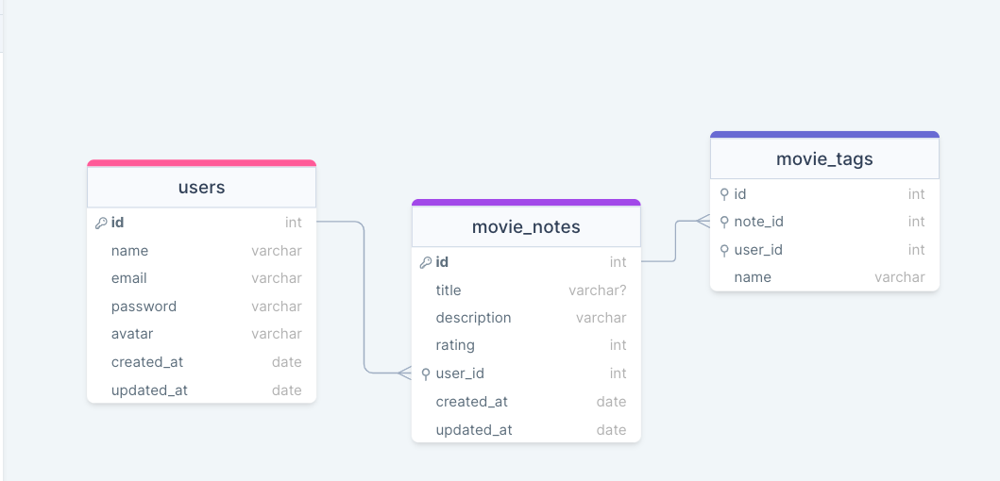

<h1 align="center"> API - Movies </h1>

  <a href="#-tecnologias">Technology</a>&nbsp;&nbsp;&nbsp;|&nbsp;&nbsp;&nbsp;
  <a href="#-projeto">Project</a>&nbsp;&nbsp;&nbsp;|&nbsp;&nbsp;&nbsp;
  <a href="#-layout">Layout</a>&nbsp;&nbsp;&nbsp;|&nbsp;&nbsp;&nbsp;
  <a href="#memo-licença">License</a>

 

<h2 align="center"> Draw SQL </h2>

  
   

## 🚀 Technology

This project was developed with the technologies below:

- SQL
- SQLite
- JavaScript
- NodeJS
- Knex
- Express
- Cors
- Bcrypt
- Git and Github
- Insomnia(Route Test)
- Beekeeper (Database view)

## 💻 Project

This API manages movie-related notes and tags, allowing users to create, retrieve, update, and delete notes tied to specific movies. Users can also assign tags to categorize these notes. The RESTful API ensures smooth interaction with the system, facilitating efficient organization and retrieval of movie-related information.
 

## :memo: License

This project is above the MIT license.

## link

<a href="https://gustavozonta.github.io/GitFav/" target="_blank"> GitFav </a>

---

 Made  ♥  by Gustavo Zonta
